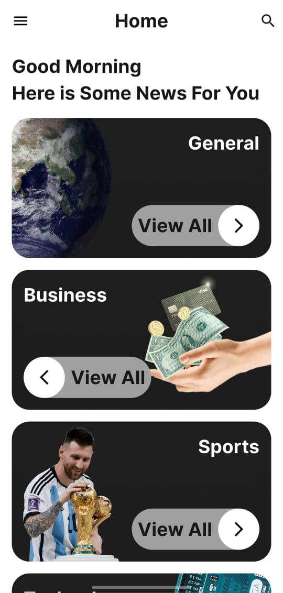
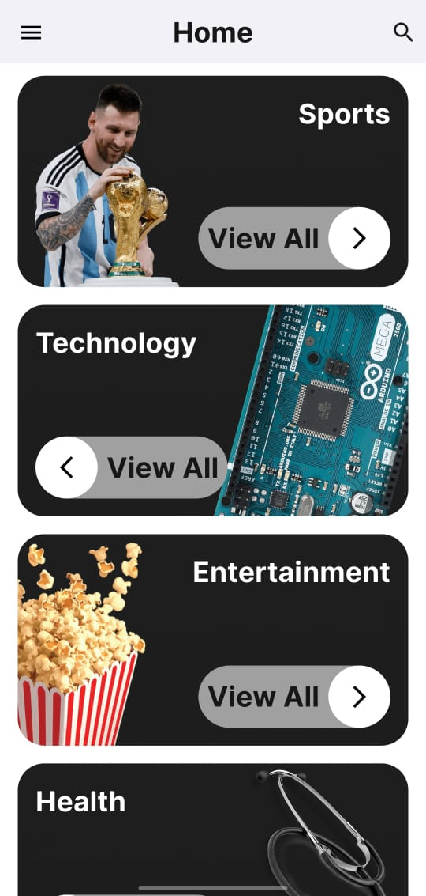
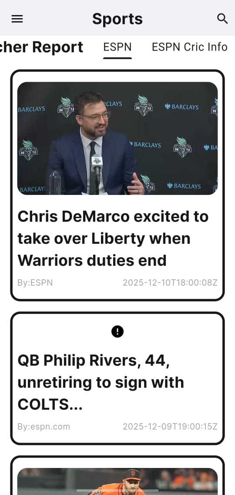
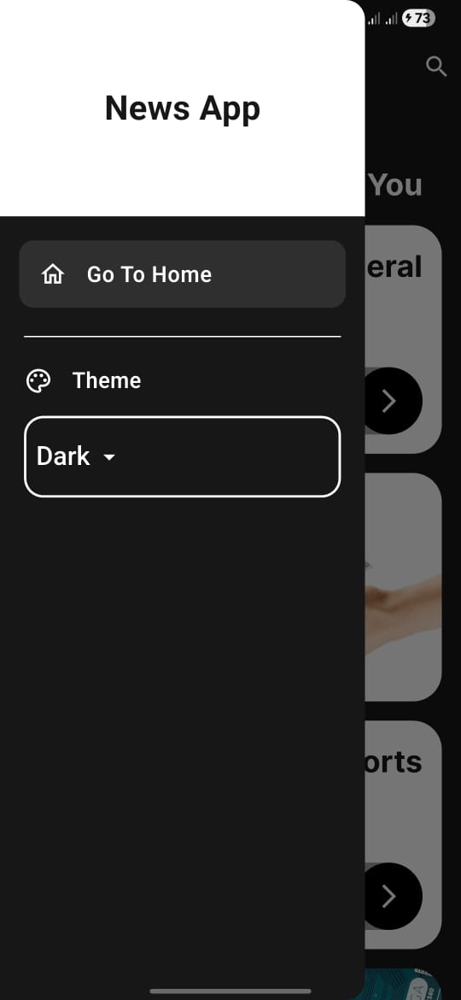
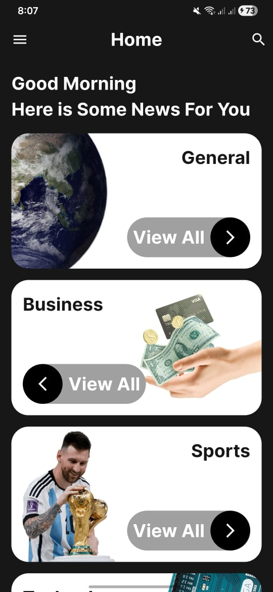

# 📰 News App

<div align="center">
  
  
  <p align="center">
    A modern and elegant news application built with Flutter
    <br />
    Stay updated with the latest news from multiple categories and sources
  </p>
</div>

## ✨ Features

- 📱 **Clean and Modern UI** - Beautiful Material Design interface with dark and light themes
- 🔄 **Real-time News Updates** - Get the latest news as it happens
- 📂 **Multiple Categories** - Browse news by General, Business, Sports, Technology, Entertainment, Health, and more
- 🎨 **Theme Support** - Switch between light and dark modes
- 🌐 **Multiple News Sources** - Access news from ESPN, ABC News, and many other trusted sources
- 📖 **Detailed Article View** - Read full articles with images and source information
- ⚡ **Fast Performance** - Optimized with image caching and efficient state management
- 🔍 **Easy Navigation** - Intuitive category-based browsing

## 📸 Screenshots

### Light Theme
<p align="center">
  
  
  
</p>

<p align="center">
  
</p>

### Dark Theme
<p align="center">
  
  
  
</p>

## 🚀 Getting Started

### Prerequisites

- Flutter SDK (3.9.2 or higher)
- Dart SDK (3.9.2 or higher)
- Android Studio / VS Code
- News API Key from [newsapi.org](https://newsapi.org)

### Installation

1. **Clone the repository**
```bash
git clone https://github.com/MohamedRafaat23/NewsApp
cd news-app
```

2. **Install dependencies**
```bash
flutter pub get
```

3. **Configure your API key**
   - Get your free API key from [News API](https://newsapi.org)
   - Add your API key to the project configuration file

4. **Run the app**
```bash
flutter run
```

## 📦 Dependencies

This project uses the following packages:

- **[dio](https://pub.dev/packages/dio)** `^5.9.0` - Powerful HTTP client for API calls
- **[provider](https://pub.dev/packages/provider)** `^6.1.5+1` - State management solution
- **[cached_network_image](https://pub.dev/packages/cached_network_image)** `^3.4.1` - Image caching for better performance
- **[google_fonts](https://pub.dev/packages/google_fonts)** `^6.3.2` - Beautiful typography
- **[pretty_dio_logger](https://pub.dev/packages/pretty_dio_logger)** `^1.4.0` - HTTP logging for debugging
- **[cupertino_icons](https://pub.dev/packages/cupertino_icons)** `^1.0.8` - iOS style icons


## 🎯 Key Features Implementation

### Architecture
- **Clean Architecture** - Separation of concerns with clear layers
- **Provider Pattern** - Efficient state management
- **Repository Pattern** - Abstract data layer for API calls

### Performance
- **Image Caching** - Fast loading with cached_network_image
- **Lazy Loading** - Efficient memory usage
- **Optimized Builds** - Minimal widget rebuilds

### UI/UX
- **Responsive Design** - Works on all screen sizes
- **Smooth Animations** - Delightful user experience
- **Error Handling** - Graceful error states with retry options

## 📱 News Categories

- 🌍 **General** - Top headlines and breaking news
- 💼 **Business** - Financial news and market updates
- ⚽ **Sports** - Latest sports news from ESPN and more
- 💻 **Technology** - Tech news and innovations
- 🎬 **Entertainment** - Movies, TV, and celebrity news
- 🏥 **Health** - Health and wellness updates

## 🔧 Configuration

### API Setup
```dart
// In your service file
class NewsService {
  final String apiKey = 'YOUR_API_KEY_HERE';
  final String baseUrl = 'https://newsapi.org/v2';
  
  // ... rest of the implementation
}
```

### Customization
You can customize the app by modifying:
- Categories in `utils/constants.dart`
- Theme colors in `utils/theme.dart`
- API endpoints in `services/news_service.dart`

## 👨‍💻 Author

**Mohamed Rafaat**
- GitHub: [@Mohamed Rafaat](https://github.com/MohamedRafaat23)
- Email: mohamedrafaatsobhy@gmail.com

  Made with ❤️ using Flutter
</div>